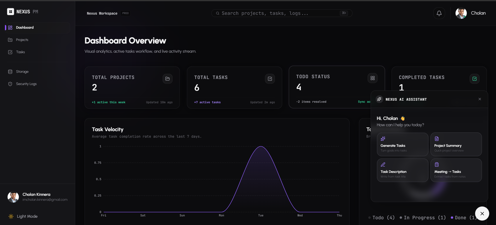

# <p align="center">Nexus PM</p>

<p align="center">
  A full-stack project management SaaS built with FastAPI, React 19, PostgreSQL, and Google Gemini AI.
</p>

<p align="center">
  
</p>

<p align="center">
  <a href="https://www.nexuspm.online" target="_blank">
    
  </a>
  
  
  
  
  
</p>

<p align="center">
  <a href="https://www.nexuspm.online" target="_blank">
    
  </a>
  <a href="docs/guides/README.md">
    
  </a>
  <a href="docs/system_architecture.md">
    
  </a>
</p>

---

## 📸 Dashboard Preview

<p align="center">
  
</p>

---

## 🎯 Features

* **Secure JWT Cookie Auth:** Stateless JWT access + database-enforced, HttpOnly SameSite cookie refresh rotation.
* **Workspace Projects:** Create, view, update, and paginate collaborative team workspaces.
* **Kanban Task Boards:** Responsive drag-and-drop boards supporting comments and file attachments.
* **Gemini AI Assistant:** Context-driven task suggestions, summaries, and meeting note extraction.
* **Cloud Storage Drive:** S3-compatible file storage hosted on Cloudflare R2 with local simulator fallbacks.
* **Live Notifications:** Feed updates and notifications triggered on task assignment and invitations.
* **Analytics Dashboard:** Real-time charts measuring task speed, completion rates, and storage volumes.
* **Containerized CI/CD:** Lightweight multi-stage builds and automated GitHub Actions verification.

---

> Full documentation available in the `/docs` folder.

---

## 💻 Technology Stack

| Service | Technology | Details |
| :--- | :--- | :--- |
| **Frontend** | React 19, TypeScript, Vite, Tailwind CSS | Single-page client app. |
| **Backend** | FastAPI, Python 3.12, Uvicorn, Gunicorn | Stateless asynchronous REST API. |
| **Database** | Supabase PostgreSQL 15 | Relational storage with connection pooling. |
| **Cache / Queue** | Upstash Redis | OTP caches, rate limiting, and signups queue. |
| **Object Store** | Cloudflare R2 | Asset attachments and files store. |
| **AI Integration** | Google Gemini (`gemini-2.5-flash`) | Core prompts execution and JSON parsing. |
| **Hosting** | Vercel (Frontend), Render (Backend) | Production environment hosting nodes. |

---

## 🏗️ Architecture & Database Design

### Logical System Interactions
Nexus PM enforces segregation between static client assets, backend API routing, and stateful databases.
* **Detailed Specifications:** See [System Architecture Guide](docs/system_architecture.md).
* **Compiled PDF Report:** See [Nexus PM Software Architecture Document (v1.0)](docs/architecture/Nexus_PM_Software_Architecture_Document_v1.0.pdf).

<p align="center">
  
</p>

### Database relational schema
Normalized database tables enforcing referential integrity, unique indices, and active foreign keys.
* **Detailed Specifications:** See [Database Schema & ERD Guide](docs/database_erd.md).

<p align="center">
  
</p>

---

## 🚀 Quick Start

```bash
# 1. Clone & Setup Backend
git clone https://github.com/Cholan-kinnera/nexus.git && cd nexus
python -m venv venv && source venv/Scripts/activate # macOS/Linux: source venv/bin/activate
pip install -r requirements.txt && cp .env.example .env
alembic upgrade head && python main.py

# 2. Setup Frontend
cd frontend && npm ci && cp .env.example .env
npm run dev
```

---

## 📄 License

Nexus PM is distributed under the **MIT License**. See `LICENSE` for details.

---

Developed by [Cholan Kinnera](https://github.com/Cholan-kinnera) · [nexuspm.online](https://nexuspm.online) · [LinkedIn](https://linkedin.com/in/cholan-abhaynadh-kinnera01)
