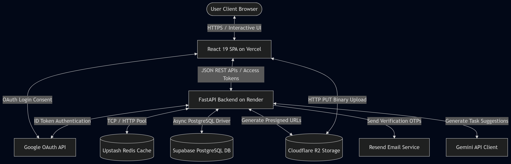
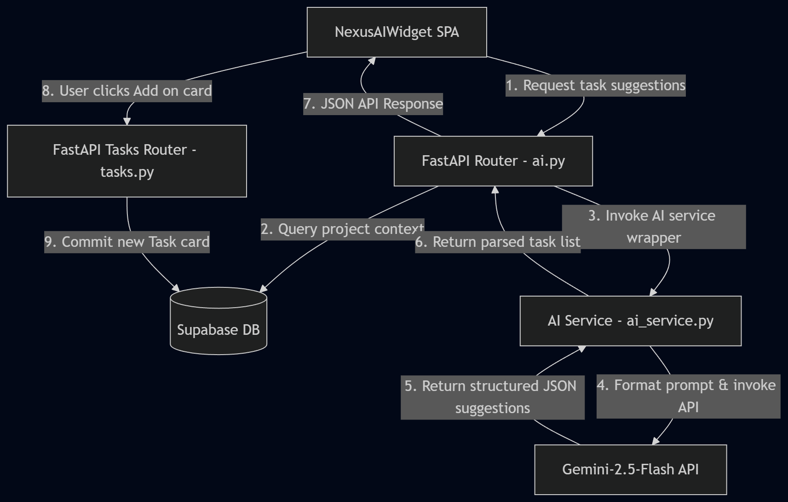
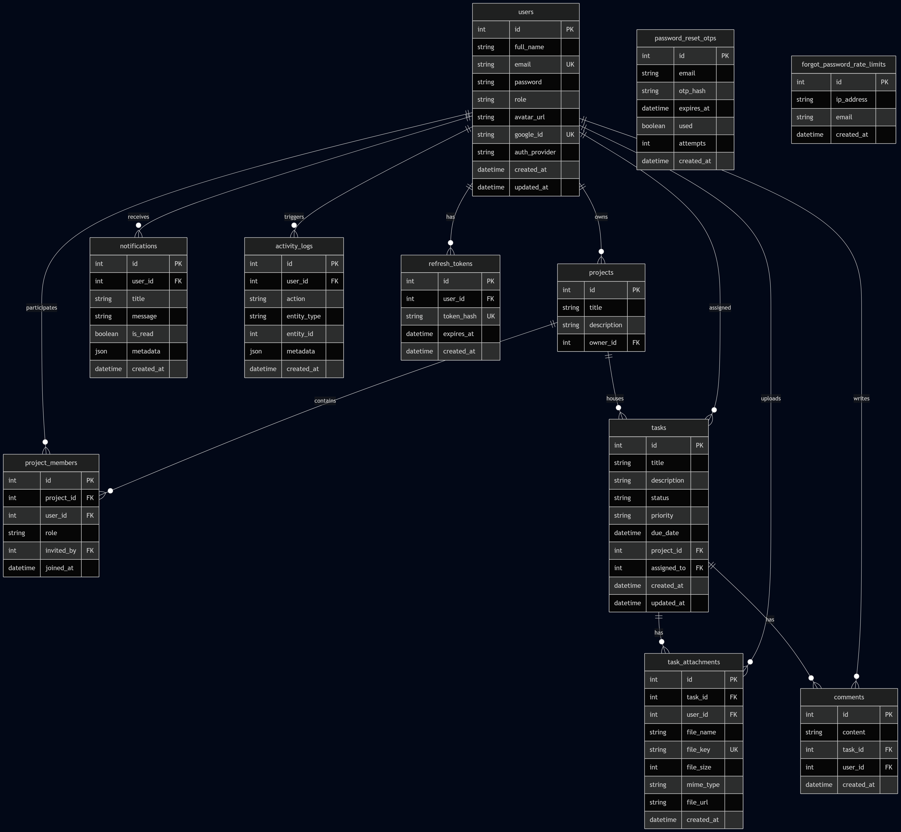
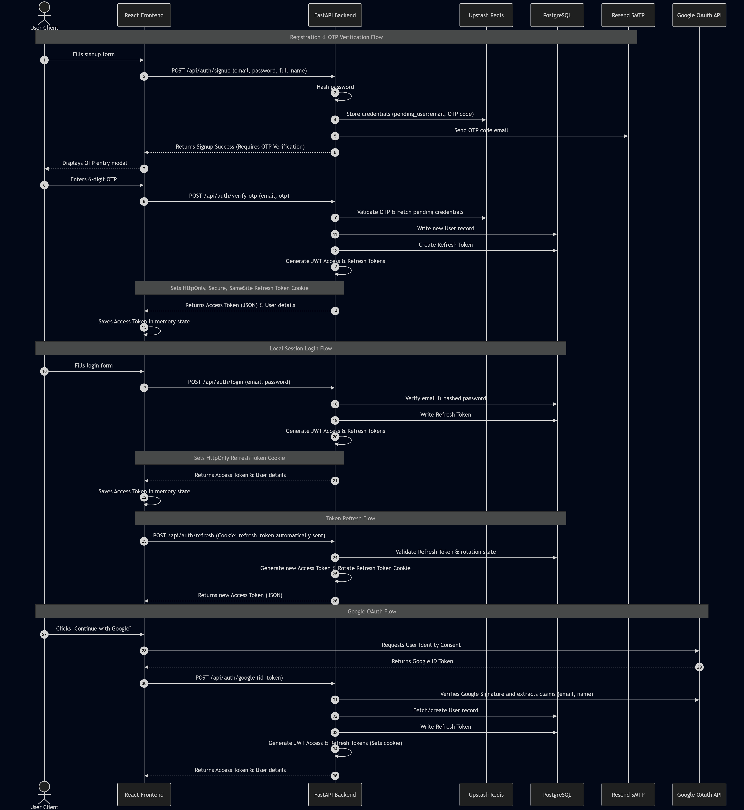
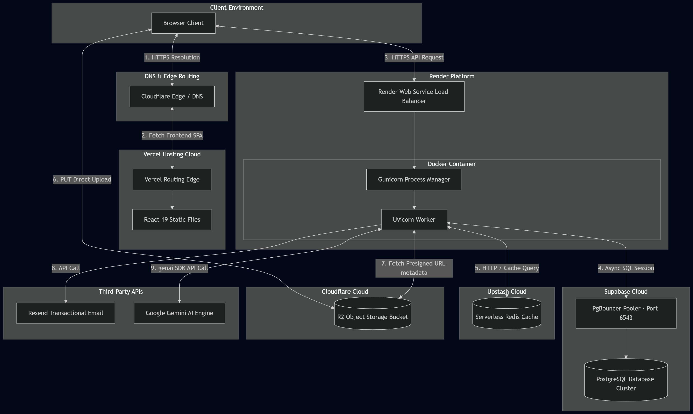

# <p align="center">Nexus PM</p>

<p align="center">
  <b>Enterprise-Grade, AI-Powered Project Management SaaS</b><br />
  Inspired by Linear and Jira. Built on scalable, asynchronous backend containers and edge-optimized frontend architectures.
</p>

<p align="center">
  
</p>

<p align="center">
  
  
  
  
  
  
  
  
</p>

<p align="center">
  <a href="https://www.nexuspm.online" target="_blank">
    
  </a>
  <a href="docs/guides/README.md">
    
  </a>
  <a href="docs/system_architecture.md">
    
  </a>
</p>

---

## 📸 System Overview

<p align="center">
  
</p>

---

## ✨ Features

* **🔐 Secure JWT Cookie Auth:** Uses short-lived JWT access tokens stored in-memory and database-enforced, HttpOnly, SameSite refresh token rotation.
* **📈 Project Board Management:** Create, spec, list, and archive workspaces with paginated listing and metadata configurations.
* **📋 Kanban Task boards:** Interactive task cards featuring dynamic due-dates, task priorities (Low, Medium, High), assignees, and comment logs.
* **🤖 Gemini AI Integration:** Context-aware task generation, executive project summaries, and meeting notes action items extractor.
* **📁 Cloud Storage Vault:** High-speed uploads and deletes linked to Cloudflare R2 with automatic fallback local simulators.
* **🔔 Live Notifications:** Keep collaborators updated with project invitation feeds and task assignment notifications.
* **📊 Systems Analytics:** Live dashboard measuring tasks completion rates, velocity, and storage allocation metrics.
* **🌩️ Production CI/CD Pipelines:** GitHub Actions workflows running automated format checks, package vulnerability audits, tests, and Docker builds.

---

## 💻 Technology Stack

| Component | Technology | Role |
| :--- | :--- | :--- |
| **Frontend** | React 19, TypeScript, Vite, Tailwind CSS | Single-page client app. |
| **Backend** | FastAPI, Python 3.12, Uvicorn, Gunicorn | Stateless asynchronous REST API gateway. |
| **Database** | Supabase PostgreSQL 15 | Relational data store with PgBouncer connection pooling. |
| **Cache / Queue** | Upstash Redis | Registration queues, OTP codes store, and rate limiter. |
| **Object Store** | Cloudflare R2 (S3-compatible) | User uploads and file attachments. |
| **AI Engine** | Google Gemini (`gemini-2.5-flash`) | Prompts execution for tasks and summaries. |
| **Email Gateway** | Resend API | Transactional OTP and password reset mailer. |
| **Environment** | Docker, Docker Compose | Development and production packaging. |
| **CI/CD** | GitHub Actions | Linters ( Ruff, Black), dependency audits, and image checks. |
| **Hosting** | Vercel (Frontend), Render (Backend container) | Global CDN serving and stateless compute node. |

---

## 🏗️ Architecture Diagrams

### System Interactions
Nexus PM enforces segregation between static assets, stateless API compute, and stateful database engines.
* **Details:** See [System Architecture Specification](docs/system_architecture.md).
<p align="center">
  
</p>

### AI Service Flow
Processes project description files using the modern `google-genai` client standard to return clean, front-end ready JSON suggestion logs.
* **Details:** See [AI Architecture Specification](docs/ai_architecture.md).
<p align="center">
  
</p>

### Database Schema (ERD)
The database structure is normalized to enforce relational integrity and index keys.
* **Details:** See [Database ERD Specification](docs/database_erd.md).
<p align="center">
  
</p>

### Session & Auth Sequences
Sequence detailing local password registration, Resend email OTP confirmations, and secure cookie refresh token rotation.
* **Details:** See [Authentication Flow Specification](docs/authentication_flow.md).
<p align="center">
  
</p>

### Deployment Topology
Network channels representing edge routing and API load balancing. Backend compute runs a optimized single Gunicorn worker to fit Render's memory tier.
* **Details:** See [Deployment Architecture Specification](docs/deployment_architecture.md).
<p align="center">
  
</p>

---

## 🚀 Quick Start

### 1. Clone
```bash
git clone https://github.com/Cholan-kinnera/nexus.git
cd nexus
```

### 2. Configure Backend
```bash
python -m venv venv
source venv/Scripts/activate # Windows: .\venv\Scripts\Activate.ps1
pip install -r requirements.txt
cp .env.example .env
alembic upgrade head
python main.py
```

### 3. Configure Frontend
```bash
cd frontend
npm ci
cp .env.example .env
npm run dev
```

---

## 📖 Documentation Index

| Executive Overviews | Technical Specifications | Operational & Dev Guides |
| :--- | :--- | :--- |
| 🌐 [Executive Summary](docs/executive_summary.md) | 🏗️ [System Architecture](docs/system_architecture.md) | 📖 [Installation Guide](docs/guides/installation.md) |
| 🛡️ [Final Review](docs/final_architecture_review.md) | 📊 [Database ERD](docs/database_erd.md) | 💻 [Local Development](docs/guides/local-development.md) |
| 📋 [Repository Audit](docs/audit.md) | 🔗 [API Specifications](docs/api_architecture.md) | 🌩️ [Deployment Guide](docs/guides/deployment.md) |
| | 🔐 [Authentication Flows](docs/authentication_flow.md) | 🔑 [Environment Variables](docs/guides/environment.md) |
| | 📁 [Storage Flows](docs/storage_architecture.md) | 🔄 [Contributing Guidelines](docs/guides/contributing.md) |
| | 🤖 [AI Architecture](docs/ai_architecture.md) | 🚨 [Troubleshooting Log](docs/guides/troubleshooting.md) |
| | | 🛠️ [Integration Examples](docs/examples/README.md) |

---

## 🔮 Roadmap

* **Current Implementation:** Stateless double-token auth, project board paginations, Cloudflare file uploads, and Gemini AI task suggestor.
* **Next Up (Near-Term):** AWS CloudWatch metrics monitoring, AWS SNS email/SMS triggers, and multi-provider AI failover policies.
* **Future Vision:** WebSockets real-time sync engine, conversational AI board controllers, and developer capacity analytics dashboards.

---

## 🤝 Contributing
Contributions are welcome. Please read our [Contributing Guidelines](docs/guides/contributing.md) to understand branch conventions, commit formatting, and code review lifecycles.

---

## 📄 License
Nexus PM is distributed under the **MIT License**. See `LICENSE` for details.

---

## 👤 Author
Developed and maintained by **[Cholan Kinnera](https://github.com/Cholan-kinnera)**.
For enquiries or feedback, feel free to reach out via GitHub.
