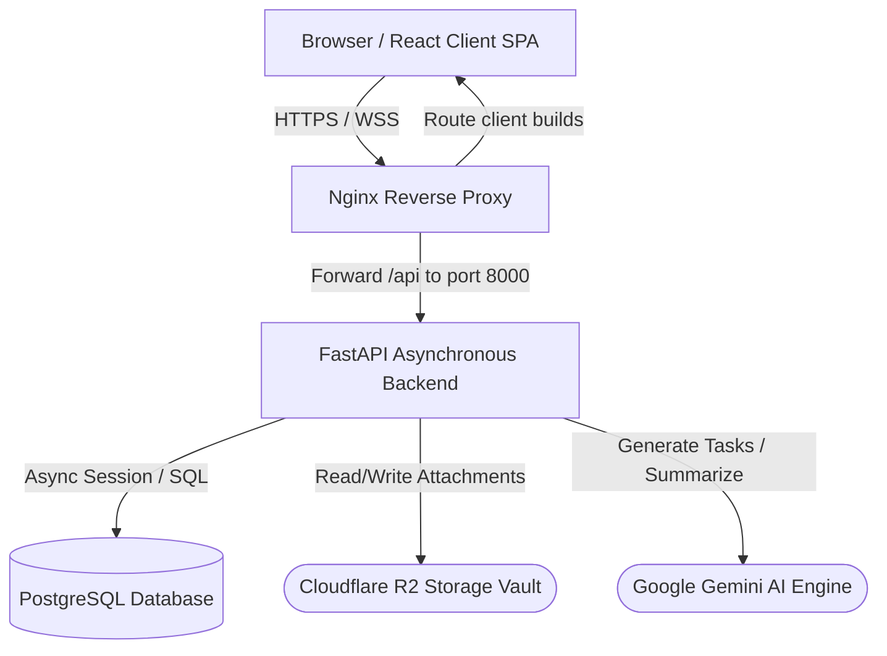

# <p align="center">Nexus PM — Resilient SaaS Project Management System</p>

<p align="center">
  
  
  
  
  
  
</p>

<p align="center">
  <a href="https://railway.app/new" target="_blank">
    
  </a>
  &nbsp;
  <a href="https://vercel.com/new" target="_blank">
    
  </a>
</p>

<div style="border: 1px solid #7c3aed; border-radius: 8px; padding: 4px; margin-bottom: 20px; background-color: #faf5ff;">
  <marquee direction="left" scrollamount="4" style="color: #7c3aed; font-family: monospace; font-weight: bold;">
    🚀 Nexus PM is active and production-ready! Deploy seamlessly to AWS, Cloudflare, Railway, or Vercel. Seamless AI integrations, dynamic task generation, and scalable storage configurations ready.
  </marquee>
</div>

Nexus PM is a highly polished, production-grade SaaS project management platform built on a resilient, modular architecture. It leverages a React 19 single-page application frontend, a robust FastAPI asynchronous REST server, PostgreSQL relational storage, and Cloudflare R2 object store virtualization.

---

## System Architecture



---

## Monorepo Directory Layout

The codebase is structured as a monorepo containing both API services and client workspaces:

```
nexus/
├── .github/workflows/    # Automated CI/CD pipelines (GitHub Actions)
├── alembic/              # Alembic SQL migration history and environment scripts
├── api/                  # FastAPI router components
│   └── routes/           # REST endpoints (auth, projects, tasks, comments, AI assistant)
├── core/                 # Core system configurations, security utilities, and middlewares
├── db/                   # Database engine instantiation and session factories
├── dependencies/         # Shared dependency injectors (auth helpers, database sessions)
├── docker/               # Production container and web-server configs (nginx.conf)
├── frontend/             # React 19 Frontend application
│   ├── public/           # Static SPA resources
│   └── src/              # Application source
│       ├── api/          # Axios HTTP clients and API services configuration
│       ├── assets/       # Styles, logos, and global graphics
│       ├── components/   # Reusable UI elements (Modals, Dropdowns, Nexus AI Floating Widget)
│       ├── context/      # Global state providers (Authentication status, Theme contexts)
│       ├── hooks/        # Custom React hooks (useAuth, useTheme)
│       ├── layouts/      # Layout templates (DashboardLayout with mounted AI Assistant)
│       ├── pages/        # Route page views (Auth page, Projects dashboard, Task boards)
│       └── services/     # Axios wrapper handlers (project, task, comment backend integrations)
├── models/               # SQLAlchemy async model mappings (User, Project, Task, Comment)
├── schemas/              # Pydantic schemas for runtime request/response validation
├── services/             # Operations wrapper layer (Cloudflare R2 attachment service, AI handlers)
├── tests/                # Automated pytest unit and integration suites
├── Dockerfile            # Production multi-stage Docker build recipe
├── docker-compose.yml    # Development orchestration (db, backend, frontend)
├── entrypoint.sh         # Startup routine (applies Alembic migrations, runs Gunicorn server)
└── README.md             # Project documentation
```

---

## Environment Configurations

Systems configuration is managed securely via environment files. Copy templates to spin up setups:

*   **[.env.example](file:///c:/NEXUS%20PM%201/.env.example)**: Structural blueprint containing all environment keys.
*   **[.env.development](file:///c:/NEXUS%20PM%201/.env.development)**: Standard pre-configured development environment variables for local runs.
*   **[.env.production](file:///c:/NEXUS%20PM%201/.env.production)**: Production template including security guidelines, SSL requirements, and R2 credentials.

Copy the development variables setup:
```bash
cp .env.development .env
```

---

## Local Development Orchestration (Docker Compose)

Launch the fully integrated multi-container system locally using Docker Compose:

### Prerequisites
*   Docker & Docker Compose installed.

### Steps
1.  Initialize the environment settings:
    ```bash
    cp .env.development .env
    ```
2.  Build and run the containers:
    ```bash
    docker-compose up --build
    ```
3.  The pipeline deploys three virtualized services:
    *   **PostgreSQL Engine** (`nexus_db`): Exposes standard port `5432` for connections.
    *   **FastAPI API Server** (`nexus_backend`): Deploys on port `8000`. Runs alembic migrations automatically on boot before starting up.
    *   **React Vite Client** (`nexus_frontend`): Served on port `80` (mapped to `http://localhost`). Static distribution files are bundled and served via Nginx.

---

## Monitoring and Health Checks

The backend provides endpoints for load balancers, Kubernetes liveness probes, and orchestration checkouts:

### 1. Simple Health Probe
*   **Endpoint**: `GET http://localhost:8000/health`
*   **Response**: `{"status": "healthy"}`
*   **Purpose**: Lightweight check (returns HTTP status 200).

### 2. Deep Integration Probe
*   **Endpoint**: `GET http://localhost:8000/health/detailed`
*   **Response**:
    ```json
    {
      "status": "healthy",
      "database": "healthy",
      "storage": "healthy",
      "timestamp": "2026-06-23T00:00:00.000000+00:00"
    }
    ```
*   **Degraded Mode Matrix**:
    *   **Healthy (200 OK)**: All core infrastructure (Database, Cloudflare R2 Vault) is fully operational.
    *   **Degraded (200 OK)**: Database is running, but R2 storage is unreachable. Users can log in, edit projects, and manage tasks, but file uploads are temporarily disabled.
    *   **Unhealthy (503 Service Unavailable)**: Database engine is offline.

---

## CI/CD Pipeline

Continuous Integration is driven by GitHub Actions inside **[.github/workflows/ci.yml](file:///c:/NEXUS%20PM%201/.github/workflows/ci.yml)**:
1.  **Backend Integration pipeline**: Launches a PostgreSQL container, executes alembic schemas, and runs unittest collections.
2.  **Frontend validation pipeline**: Boots Node.js 20 environment, verifies lint formatting compliance (ESLint), and executes the production Vite build pipeline.

---

## Production Deployment Blueprint

Deploy Nexus PM to scalable cloud providers:

### 1. Database (RDS / Supabase / Neon)
*   Deploy a managed PostgreSQL cluster.
*   Set the `DATABASE_URL` config variable pointing to the target DB cluster.

### 2. File Attachments (Cloudflare R2 / AWS S3)
*   Set bucket configs: `R2_ACCOUNT_ID`, `R2_ACCESS_KEY_ID`, `R2_SECRET_ACCESS_KEY`, and `R2_BUCKET_NAME`.
*   Establish public asset path mapping via `R2_PUBLIC_URL`.

### 3. Backend Service (Railway / Render / AWS ECS)
*   Deploy from repository root.
*   Specify the production `Dockerfile` for container packaging.
*   Alembic auto-migration will execute on container launch.

### 4. Frontend SPA (Vercel / Cloudflare Pages / Netlify)
*   Set build presets:
    *   **Root Directory**: `frontend`
    *   **Build script**: `npm run build`
    *   **Build Output**: `dist`
*   Point `VITE_API_URL` to your production backend domain (e.g., `https://api.nexus.com`).
