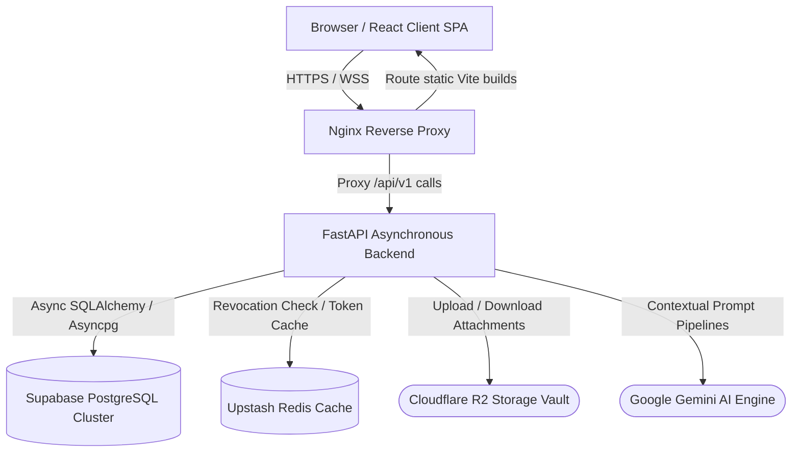
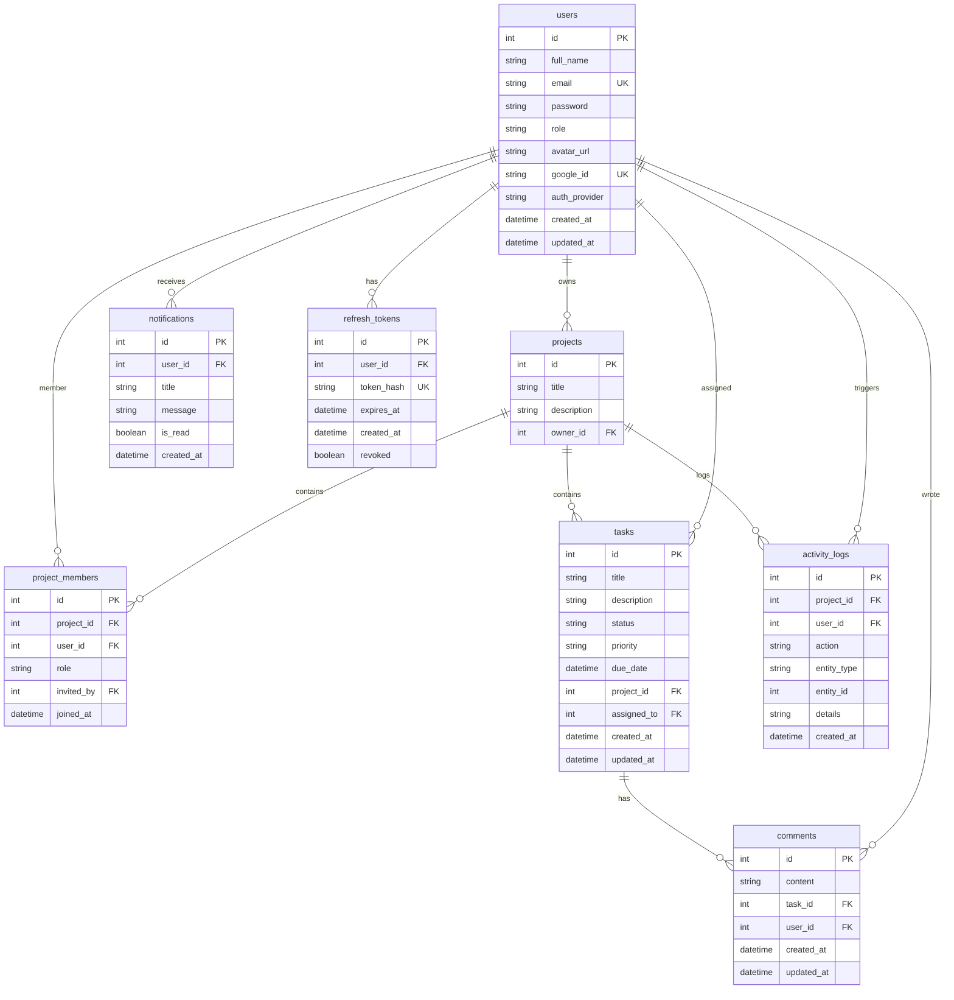

# <p align="center">Nexus PM — Enterprise-Grade SaaS Project Management Platform</p>

<p align="center">
  
  
  
  
  
  
  
  
</g>
</p>

<p align="center">
  <a href="https://github.com/Cholan-kinnera/nexus/actions/workflows/ci.yml">
    
  </a>
  
  
</p>

<p align="center">
  <a href="https://www.nexuspm.online" target="_blank">
    
  </a>
</p>

<p align="center">
  
</p>

<p align="center">
  <b>A highly-scalable, production-ready project management SaaS inspired by Linear and Jira. Built on modular, asynchronous full-stack systems.</b>
</p>

---

## 🌐 Production Deployment

| Parameter | Configuration / Metric |
| :--- | :--- |
| **Live Platform URL** | [https://www.nexuspm.online](https://www.nexuspm.online) |
| **Release Status** | `Production Ready` |
| **Core Architecture** | React 19 SPA + Asynchronous FastAPI REST Server |
| **Data Architecture** | Supabase PostgreSQL Cluster + Upstash Redis cache |
| **Object Store** | Cloudflare R2 Virtualized Vault |
| **AI Orchestration** | Google Gemini 2.5 Flash Engine |

---

## 📸 Social Sharing Preview

<p align="center">
  
</p>

<meta property="og:title" content="Nexus PM - Production-Ready AI SaaS" />
<meta property="og:image" content="docs/images/social-preview.png" />
<meta property="og:description" content="AI-Powered project management platform running React 19, FastAPI, Redis, and Supabase." />

---

## 📌 Navigation & Index
- [🛠️ Technical Highlights](#-technical-highlights)
- [💻 Product Showcase](#-product-showcase)
- [🧩 Product Capabilities](#-product-capabilities)
- [🔮 AI Workflow Capabilities](#-ai-workflow-capabilities)
- [🏗️ System Architecture](#️-system-architecture)
- [📊 Database Relational Schema (ERD)](#-database-relational-schema-erd)
- [🛡️ Engineering Challenges Solved](#️-engineering-challenges-solved)
- [🗺️ Upgraded Roadmap](#️-upgraded-roadmap)
- [🔗 API Router Reference](#-api-router-reference)
- [📂 Monorepo Repository Structure](#-monorepo-repository-structure)
- [🚀 Local Development Setup](#-local-development-setup)
- [🌩️ Infrastructure & Deployment Map](#️-infrastructure-&-deployment-map)
- [💡 Why This Project Matters (For Recruiters)](#-why-this-project-matters-for-recruiters)

---

## 🛠️ Technical Highlights

*   **JWT Auth with Refresh Rotation:** High-security session logic enforcing stateless Access Tokens and database-validated, single-use, rotated Refresh Tokens.
*   **Role-Based Access Control (RBAC):** Strict project boundaries (viewer, editor, owner) validated via routing middlewares on all resources.
*   **Asynchronous Database Core:** Asynchronous SQL querying utilizing SQLAlchemy 2.0 Async engine and Greenlet-based thread pooling.
*   **Cloudflare R2 File Integration:** S3-compatible file storage integrating low-latency attachment pipelines.
*   **AI Context Pipelines:** Custom prompt injection utilizing user context to write tasks, summaries, and meeting action items.
*   **Production Dockerization:** Lightweight multi-stage builds serving Vite builds through Nginx reverse proxies.

---

## 💻 Product Showcase

### 1. Unified Landing & Marketing Screen
<p align="center">
  
</p>

### 2. Workspace Control Dashboard
<p align="center">
  
</p>

### 3. Asynchronous Project Views & Kanban boards
<p align="center">
  
</p>

### 4. Floating Nexus AI Conversational Interface
<p align="center">
  
</p>

---

## 🧩 Product Capabilities

### 🔐 Authentication & Security
*   Stateless JWT access verification combined with database-enforced Refresh Token rotation.
*   Secure, encrypted password hashing utilizing bcrypt engines.
*   Built-in Google OAuth SSO.
*   Forgot-password operations utilizing secure, time-limited OTP tokens.

### 📁 Project & Membership Control
*   Dynamic project creation dashboards with customizable metadata.
*   Collaborative invite tokens mapping users to projects with granular RBAC permissions.
*   Comprehensive user role mapping (Viewer, Editor, Administrator).

### 📋 Task Management & Kanban Boards
*   Interactive drag-and-drop boards driven by responsive React layout states.
*   Asynchronous priority tagging, due-date controls, and comments logging.
*   Multi-type file attachments uploaded directly to Cloudflare R2 vaults.

### 📈 Activity & Notification Logging
*   Audit trails tracking project adjustments, members added, and task completions.
*   Real-time in-app notifications prompting users when tasks are assigned or updated.

---

## 🔮 AI Workflow Capabilities

Nexus PM integrates generative workflows as core product features:

*   **AI Task Generation:** Automatically breaks down high-level project specs into clear, independent tasks containing formatted descriptions.
*   **AI Project Summaries:** Analyzes recent tasks, logs, and activity records to synthesize high-level progress reports.
*   **Task Description Generator:** Generates formatted markdown descriptions directly from brief task titles.
*   **Meeting Notes → Action Items:** Parses transcripts or meeting notes to extract structured task suggestions and priorities.

---

## 🏗️ System Architecture

### System Architecture Overview
The architecture is designed to enforce complete segregation between stateful data, static assets, and stateless compute. 

<p align="center">
  
</p>



---

## 📊 Database Relational Schema (ERD)



---

## 🛡️ Engineering Challenges Solved

### 1. Robust Asynchronous Session Management
*   **The Problem:** Traditional database checks for JWTs increase load on primary database clusters, degrading latency during traffic spikes.
*   **The Solution:** Implemented stateless Access Tokens and mapped Refresh Tokens to a rotated system stored in database tables. To secure sessions against token theft, we leverage a single-use revocation mechanism: when a refresh token is reused, the entire token family is instantly revoked.

### 2. High-Performance Asynchronous Database Operations
*   **The Problem:** Sync database queries create thread contention, which blocks FastAPI's event loop and reduces performance.
*   **The Solution:** Integrated SQLAlchemy 2.0's asyncpg engine. Combined with async context managers and scoped session makers, this handles parallel connections smoothly under heavy read-write operations.

### 3. Context-Aware AI Prompt Orchestration
*   **The Problem:** Generative AI APIs can be slow, block connections, or return raw unstructured text that is difficult for frontends to parse.
*   **The Solution:** Implemented asynchronous client calls to Gemini 2.5 Flash. We use system prompt structures to enforce JSON schemas (e.g. mapping tasks with exact title, description, and priority fields) with graceful fallbacks to raw text parsers on parsing failure.

### 4. Cloud Object Store Attachment Pipeline
*   **The Problem:** Proxying large file uploads through backend API servers consumes server memory, limits throughput, and degrades API response times.
*   **The Solution:** Integrated Cloudflare R2 with an asynchronous bucket service. Attachments are uploaded directly from the backend using presigned URLs or mapped asynchronously to prevent memory bottlenecks.

---

## 🗺️ Upgraded Roadmap

### Phase 1: Current Capabilities (Production)
*   [x] Stateless JWT authentication & Refresh Token rotation.
*   [x] Drag-and-drop Kanban Board layout.
*   [x] Asynchronous Project & Task control boards.
*   [x] Four core AI operations powered by Gemini 2.5 Flash.
*   [x] Sub-minute attachment processing via Cloudflare R2.

### Phase 2: Upcoming Features (Near-Term)
*   [ ] **AWS CloudWatch integration:** Log streams, metric alarms, and custom latency checks.
*   [ ] **AWS SNS SMS/Email Alerts:** SMS alerts on critical tasks, deadlines, or project milestones.
*   [ ] **Multi-Provider AI Fallback:** Support for AWS Bedrock (Claude models) as a high-availability fallback.

### Phase 3: Future Vision (Long-Term)
*   [ ] **Conversational AI Co-Pilot:** Direct chat inside the panel to modify states via text.
*   [ ] **Real-time WebSockets:** Live cursor tracking and instantaneous Kanban card movement.
*   [ ] **Team Productivity Analytics:** Visual metrics on task velocity and team workload distribution.

---

## 🔗 API Router Reference

### Authentication Routing
| Method | Path | Description | Access |
| :--- | :--- | :--- | :--- |
| `POST` | `/api/v1/auth/register` | Create a new user profile | Anonymous |
| `POST` | `/api/v1/auth/login` | Authenticate and issue JWT tokens | Anonymous |
| `POST` | `/api/v1/auth/refresh` | Rotate expired Access Token using Refresh Token | Anonymous |
| `POST` | `/api/v1/auth/logout` | Revoke session and invalidate tokens | Authenticated |

### Projects & Members Routing
| Method | Path | Description | Access |
| :--- | :--- | :--- | :--- |
| `GET` | `/api/v1/projects` | Fetch all user-accessible projects | Authenticated |
| `POST` | `/api/v1/projects` | Create a new project workspace | Authenticated |
| `GET` | `/api/v1/projects/{id}` | Retrieve project details | Owner/Member |
| `POST` | `/api/v1/projects/{id}/members` | Invite new user to project team | Owner/Admin |

### Tasks & Comments Routing
| Method | Path | Description | Access |
| :--- | :--- | :--- | :--- |
| `GET` | `/api/v1/tasks` | Fetch list of project tasks | Member |
| `POST` | `/api/v1/tasks` | Create a new task item | Member |
| `PUT` | `/api/v1/tasks/{id}` | Update task details (Kanban movement) | Member |
| `POST` | `/api/v1/tasks/{id}/comments` | Add comment thread log | Member |

### AI Workflow Routing
| Method | Path | Description | Access |
| :--- | :--- | :--- | :--- |
| `POST` | `/api/v1/ai/projects/{id}/generate-tasks` | AI-generate project tasks checklist | Member |
| `POST` | `/api/v1/ai/projects/{id}/summarize` | Generate project progress summary | Member |
| `POST` | `/api/v1/ai/tasks/{id}/generate-description` | Generate markdown description from task title | Member |
| `POST` | `/api/v1/ai/projects/{id}/meeting-to-tasks` | Extract actionable tasks from meeting notes | Member |

---

## 📂 Monorepo Repository Structure

```
nexus/
├── .github/workflows/    # CI/CD Workflows (ci.yml)
├── alembic/              # Database migration scripts
├── api/                  # FastAPI Application Endpoints
│   └── routes/           # Routing controllers (auth, projects, tasks, comments, AI)
├── core/                 # Config declarations, token issuers, logging filters, and middleware
├── db/                   # Database engine configuration and session factories
├── dependencies/         # Shared dependency injectors (get_db, get_current_user)
├── docker/               # Production container configurations (nginx.conf)
├── frontend/             # React 19 Frontend application
│   ├── public/           # Static distribution folders
│   └── src/              # Application source
│       ├── api/          # Axios configurations and global clients
│       ├── components/   # UI elements (modals, loaders, AI Widget)
│       ├── context/      # Context providers (auth state, theme engine)
│       ├── layouts/      # Dashboard containers
│       └── pages/        # Main route views (dashboard, profiles, boards)
├── models/               # SQLAlchemy ORM declarations
├── schemas/              # Pydantic validation schemas
├── services/             # Operations (Cloudflare R2 upload, activity-log service, Gemini client)
├── tests/                # Automated pytest unit and integration suites
├── Dockerfile            # Multi-stage production build script
├── docker-compose.yml    # Development system orchestrator
└── entrypoint.sh         # Startup setup script
```

---

## 🚀 Local Development Setup

### System Prerequisites
*   Python 3.11+
*   Node.js 20+
*   PostgreSQL / Supabase account
*   Upstash Redis account
*   Cloudflare R2 bucket

### 1. Clone & Core Setup
```bash
git clone https://github.com/Cholan-kinnera/nexus.git
cd nexus
```

### 2. Backend Installation & Configurations
```bash
# Set up virtual environment
python -m venv venv
source venv/Scripts/activate  # Windows
# source venv/bin/activate    # macOS/Linux

# Install modules
pip install -r requirements.txt

# Configure env
cp .env.development .env
```
Update your `.env` with actual DB, Redis, R2, and Google Gemini credential keys.

### 3. Apply Schema Migrations
```bash
alembic upgrade head
```

### 4. Run Backend Server
```bash
uvicorn main:app --reload --port 8000
```

### 5. Frontend Client Setup
```bash
cd frontend
npm install

# Run Vite dev server
npm run dev
```

---

## 🌩️ Infrastructure & Deployment Map

*   **Frontend SPA Hosting (Vercel):** Connected directly to `frontend/` directory, Vite bundles are deployed dynamically on pushes to the production branch.
*   **REST Server Compute (Render):** Dockerized backend service runs via multi-stage builds. Auto-deploys on master pushes.
*   **Supabase PostgreSQL:** Managed DB cluster running auto-applied schemas via Alembic.
*   **Upstash Redis Server:** Cloud-native Redis cache for fast token validation and session store.
*   **Domain Management:** `nexuspm.online` custom domain configured with SSL certificates and CDN proxying.

---

## 💡 Why This Project Matters (For Recruiters)

Nexus PM is designed as a **production-grade enterprise solution**. It avoids standard tutorials templates and shows mastery of full-stack engineering, cloud design, and architectural security:

*   **Mastery of Asynchronous Pipelines:** Leverages full async integration from HTTP controllers (FastAPI) to database level (SQLAlchemy Async engine + asyncpg).
*   **Zero-Trust Session Architecture:** Enforces rotating refresh tokens to mitigate session hijacking attempts.
*   **Production Cloud Integrations:** Integrates distributed Supabase clusters, Cloudflare R2 file storage, and Upstash cache servers.
*   **Automated Verification (CI/CD):** Enforces automated build checks, code validation, and unit tests on every code change before production deployments.
