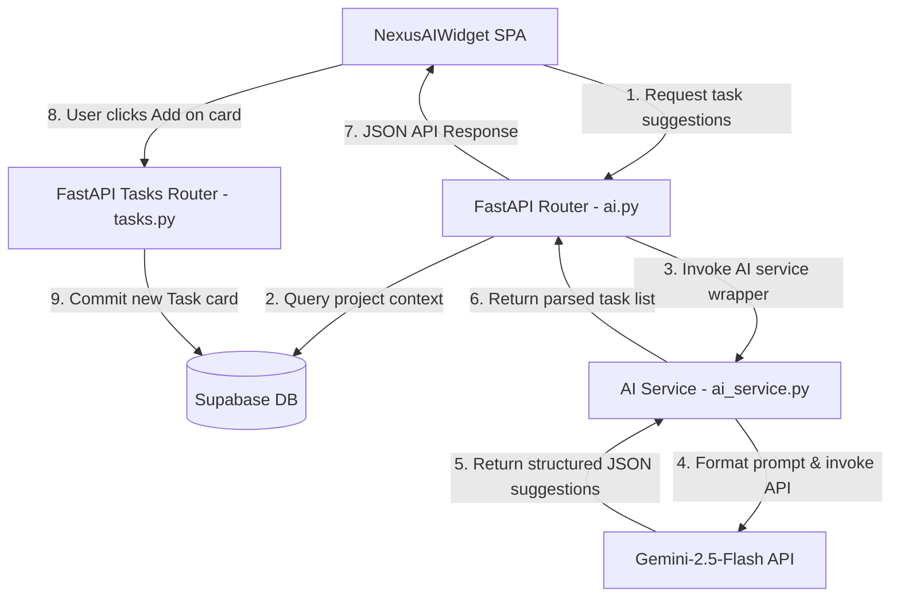

# AI Architecture — Nexus PM

This document describes the generative AI integrations in Nexus PM, detailing the current implementation and the planned roadmap.

---

## 1. Current Implementation: AI Task Suggestions

The only active AI capability in the platform is **AI Task Suggestions**. This feature reads a project's metadata and description, uses a LLM to generate logical follow-up tasks, and lets users add cards to their Kanban boards with a single click.

### Technical Stack
* **SDK:** `google-genai` (Migrated to the modernized client structure).
* **Model:** `gemini-2.5-flash`.
* **Frontend Controller:** `NexusAIWidget.tsx`.
* **Backend Controller:** `ai_service.py` & `api/routes/ai.py`.

### AI Task Generation Flow



---

## 2. Codebase Integration Details

### Prompt Construction
The backend extracts description text from the project DB. The `ai_service` provides instructions to the Gemini model to parse the context and return a valid JSON array of tasks matching this schema:
```json
[
  {
    "title": "Task title summary",
    "description": "Task detailed checklist and subgoals",
    "priority": "LOW | MEDIUM | HIGH"
  }
]
```

### Modernized Client Instantiation
In [ai_service.py](file:///c:/NEXUS%20PM%201/services/ai_service.py), the client utilizes the new Google GenAI standard library:
```python
from google import genai

client = genai.Client(api_key=settings.GEMINI_API_KEY)
response = client.models.generate_content(
    model="gemini-2.5-flash",
    contents=prompt,
    config=types.GenerateContentConfig(
        response_mime_type="application/json",
        response_schema=TaskSuggestionsListSchema
    )
)
```

---

## 3. Planned Features (Roadmap)

To deliver a comprehensive AI-powered project suite, the following capabilities are planned for upcoming releases:

### A. Project Summary
* **Goal:** Create a high-level summary of active sprints, completed milestones, and lagging blocks.
* **Mechanism:** Feed recent activity logs and comments into Gemini to generate an executive status summary.

### B. Meeting Notes → Tasks
* **Goal:** Parse transcribed team meetings to automatically identify action items and draft task cards.
* **Mechanism:** Receive audio/text logs, scan for action verbs and assignments, and suggest task cards directly to the PM.

### C. Sprint Planner
* **Goal:** Recommend task allocation and timeline schedules based on past team velocity metrics.
* **Mechanism:** Compare past developer card completion speeds to dynamic timelines.

### D. Project Health Analysis
* **Goal:** Flag risk values for projects that have pending deadlines but low completion velocity.
* **Mechanism:** Execute scheduled background regression evaluations to flag at-risk task blocks.
