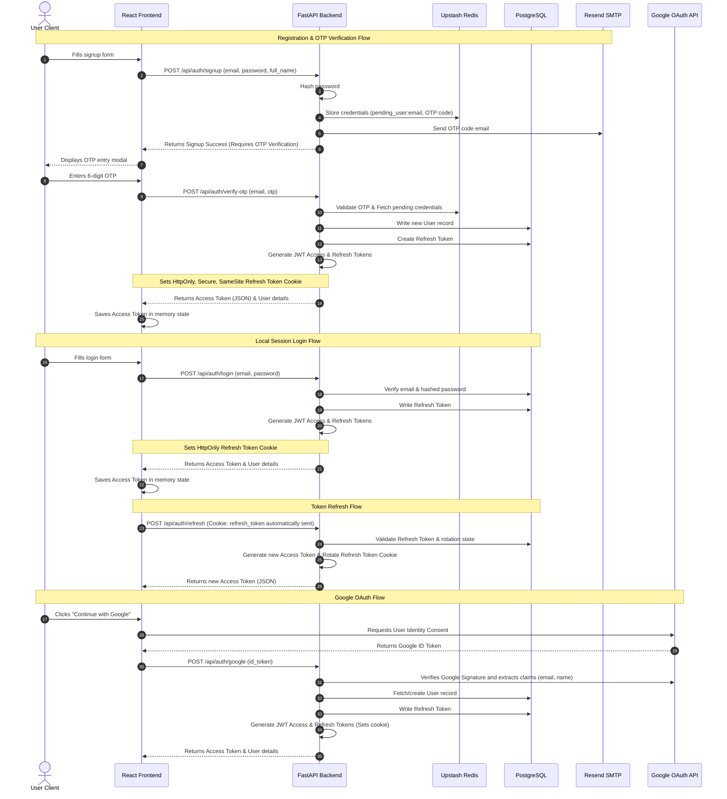

# Authentication Flow — Nexus PM

This document details the security and authentication patterns implemented in Nexus PM, including the OTP sign-up, local login, session refresh, and Google OAuth flows.

---

## 1. Authentication Lifecycle Diagram

---

## 2. Design Security Mechanisms

### Token Storage Strategy
* **Access Token:** A short-lived (configured default: 60 minutes) JWT bearer token returned in the JSON response body. The React application keeps it in JavaScript runtime memory (`useState` / Context). It is never saved to `localStorage` or `sessionStorage` to block Cross-Site Scripting (XSS) vectors.
* **Refresh Token:** A long-lived JWT token returned via an HTTP-Only, Secure, SameSite=Lax cookie named `refresh_token`. The browser manages cookie storage and automatically appends it to requests sent to `/api/auth/refresh` or `/api/auth/logout`.

### Session Refresh Rotation
1. When the client intercepts an API call failure due to expired access tokens, it sends a POST request to `/api/auth/refresh`.
2. The backend extracts the `refresh_token` from the HttpOnly cookie, verifies the signature, and matches the token ID against stored refresh sessions in PostgreSQL.
3. If valid, the backend generates a new Access Token, issues a brand new rotated Refresh Token, commits the new token ID to the database, and responds. The old token is invalidated.

### Double-Lock Registration (Redis OTP)
To prevent database bloat from unverified email submissions, the backend implements a registration queue:
* User profile details (and hashed passwords) are stored in Upstash Redis with a 15-minute TTL.
* When the client provides the correct OTP, the details are fetched from Redis and committed to PostgreSQL. Unverified registrations expire automatically without impacting database storage.
