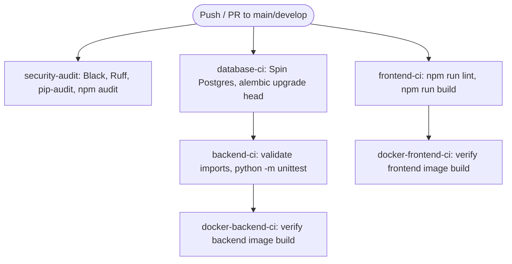

# CI/CD Pipeline Architecture — Nexus PM

This document specifies the continuous integration and delivery architecture, detailing the workflow configurations under `.github/workflows/ci.yml`.

---

## 1. CI/CD Workflow Stages

The GitHub Actions configuration runs automated validations on every push or pull request to the `main` or `develop` branch:

---

## 2. Job Specification Breakdown

### A. Security & Code Quality Audits (`security-audit`)
* **Code Formatting:** Runs `black --check .` to ensure Python files adhere to pep8 standard spacing.
* **Code Linting:** Runs `ruff check .` to check for imports, dead lines, or syntax violations.
* **Python Packages Check:** Runs `pip-audit -r requirements.txt` to verify backend dependencies are free from CVEs.
* **Frontend Packages Check:** Runs `npm audit --audit-level=moderate` under `frontend` to lock node package version warnings.

### B. Frontend Compilation (`frontend-ci`)
* Runs ESLint checks using `npm run lint`.
* Verifies static package bundling using `npm run build` (Vite compiler).

### C. Database Migration Integrity (`database-ci`)
* Spins up a PostgreSQL 15 service container.
* Runs database migrations sequentially using `alembic upgrade head`.
* Confirms migration integrity using `alembic current`.

### D. Backend Tests (`backend-ci`)
* Spins up a PostgreSQL 15 service container.
* Compiles Python classes using `python -m compileall -q .` to check for syntax failures.
* Verifies route registration using `python -c "import main"`.
* Triggers Python unit tests using `python -m unittest discover -s tests`.

### E. Container Builds (`docker-backend-ci` & `docker-frontend-ci`)
* Uses `docker/setup-buildx-action` to build Docker images:
  * **Backend Image:** Verifies root [Dockerfile](file:///c:/NEXUS%20PM%201/Dockerfile) build.
  * **Frontend Image:** Verifies [frontend/Dockerfile](file:///c:/NEXUS%20PM%201/frontend/Dockerfile) build with `VITE_API_URL` arguments.
