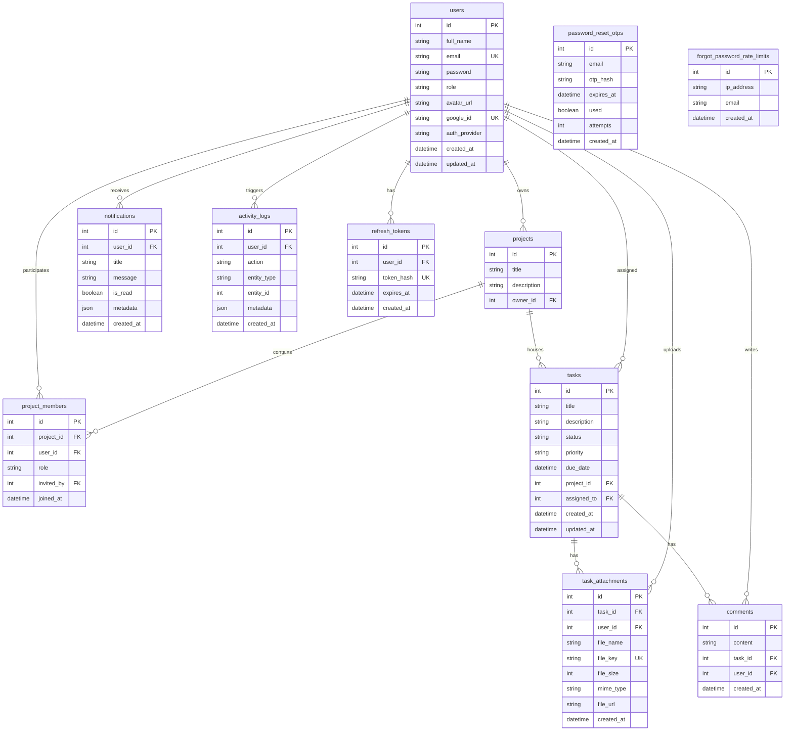

# Database Entity Relationship Diagram — Nexus PM

This document presents the schema architecture of the PostgreSQL database, visualised using a Mermaid ER Diagram directly derived from the SQLAlchemy models.

---

## 1. Entity Relationship Diagram

---

## 2. Model Breakdown & Relationships

### Core Workspaces
* **`users`:** The central tenant directory. Accounts authenticate via local email/password credentials or Google SSO integration mappings.
* **`projects`:** Core working boards. Each project links to an owner (`owner_id`) representing the user who generated the board.
* **`project_members`:** A many-to-many relationship bridge connecting `users` to `projects` with specific roles (Owner, Manager, Developer, Viewer).

### Task Boards
* **`tasks`:** Individual action cards associated with a `project`. Tasks track a specific state (TODO, IN_PROGRESS, DONE) and priority weighting. They can be assigned to a team member (`assigned_to`).
* **`task_attachments`:** Tracks binary objects uploaded to the storage bucket. Attachments are isolated by task and uploader context.
* **`comments`:** Tracks text feedback messages posted under task cards.

### Monitoring & Security Logs
* **`notifications`:** Multi-tenant unread alert lists pushed to the client UI.
* **`activity_logs`:** Auditable system operation logs tracking changes across resources.
* **`refresh_tokens`:** Stores cryptographically hashed access tokens to coordinate session rotation.
* **`password_reset_otps` / `forgot_password_rate_limits`:** Unassociated validation tables used to protect authentication routes against password reset brute-forcing.
