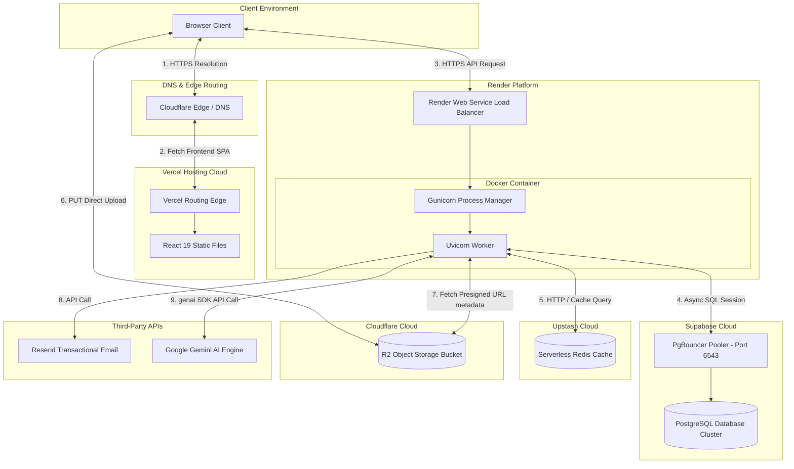

# Deployment Architecture — Nexus PM

This document maps out the production deployment layout, network pathways, and service boundaries.

---

## 1. Production Deployment Diagram

---

## 2. Platform Infrastructure Roles

### Vercel (Frontend SPA)
* **Domain:** `https://www.nexuspm.online`
* **Role:** Serves the compiled React client package. Automatically routes incoming traffic to the closest geographical CDN node to optimize client load times.

### Render (Backend Web Service)
* **Domain:** `https://nexus-pm-backend-21kc.onrender.com`
* **Role:** Pulls the root Dockerfile, builds the container image, executes database migration scripts (`alembic upgrade head`), and spins up a Gunicorn server mapping requests to the FastAPI `main:app` instance.

### Supabase (Database)
* **Role:** Hosts the database storage node. Coordinates client calls using a PgBouncer connection pooler to prevent backend connection leaks during asynchronous processing.

### Upstash (Redis Cache)
* **Role:** Provides serverless, low-latency Redis caching. Used by the backend to store user metadata profiles during registration workflows, OTP counters, and rate-limiting hashes.

### Cloudflare R2 (Object Storage)
* **Role:** Hosts files and avatar uploads. Presigned download links allow direct browser retrieval via Cloudflare's zero-egress cost network.

### Resend (Email gateway)
* **Role:** Transactional mail server dispatching verification messages and password reset tokens.

### Google Gemini API
* **Role:** Processes prompts and returns JSON structured task recommendations.
