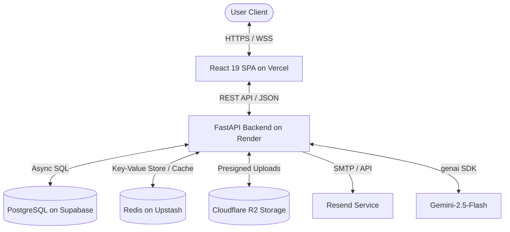

# Executive Summary — Nexus PM

## Project Purpose
Nexus PM is an AI-powered project management platform designed to deliver a modern, high-performance workspace similar to industry tools like Linear and Jira. The system coordinates project definitions, task management, commenter threads, notifications feeds, cloud object storage, and generative AI features into an integrated, production-grade SaaS.

## Architecture Overview
The system is built on a clean separation of concerns using a **React + FastAPI** decoupled monorepo architecture:
* **Frontend:** A React 19 single-page application (SPA) styled with Tailwind CSS, utilizing TypeScript for type safety, and optimized with Vite.
* **Backend:** A FastAPI asynchronous web application using Python 3.12, utilizing SQLAlchemy (asyncpg) to map database entities, Redis for caching/OTP management, and the `google-genai` SDK for Gemini model integration.

## Cloud Stack
The production infrastructure leverages serverless and managed cloud platforms to maximize scalability and eliminate server maintenance overhead:
* **Frontend Hosting:** Vercel (Edge network routing, build automation).
* **API Hosting:** Render (Web Service container running Gunicorn + Uvicorn worker).
* **Database:** Supabase (Managed PostgreSQL, connection pooling, automated backups).
* **Caching & Sessions:** Upstash Redis (Serverless Redis accessed via HTTP/TCP clients).
* **Object Storage:** Cloudflare R2 (S3-compatible, zero-egress cost bucket).
* **Email Gateway:** Resend (Transactional emails, email template compiling).
* **AI Engine:** Google Gemini API (`gemini-2.5-flash`).

## Security Features
1. **Double-Token Auth Architecture:** Decoupled JWT model using Short-Lived Access Tokens (in memory/state) and HTTP-Only, SameSite=Lax, Secure Refresh Tokens (stored in cookies) to mitigate XSS and CSRF vectors.
2. **Dynamic OTP Verification:** User registration is queued in Redis and verified using dynamic email OTPs (via Resend) before writing to PostgreSQL.
3. **CORS & Host Lockdown:** Domain locks on API endpoints, checking origins explicitly (`ALLOWED_ORIGINS`) and validating request headers using FastAPI `TrustedHostMiddleware`.
4. **Secure File Uploads:** Upload flows utilize Cloudflare R2 presigned URLs. No client-submitted files are saved directly to the backend disk, preventing arbitrary execution/DOS exploits.

## AI Features
* **Generative Task Lists:** The platform reads project context and description objects, utilizes Gemini-2.5-Flash via the Google `genai` SDK to draft structured task logs, and provides developers one-click integration to map cards directly to Kanban boards.

## Production Readiness Score
The Nexus PM codebase scoring evaluates current implementation readiness:

| Category | Score | Justification |
| :--- | :--- | :--- |
| **Security** | 92 / 100 | Uses HTTP-only cookie-refresh rotation, OTP signup verification, and CORS lockdowns. Needs active CSRF token validation and rate-limiting rules. |
| **Scalability** | 88 / 100 | Decoupled client-server design, serverless caching, and stateless backend execution. Reduced Gunicorn worker count to fit Render free-tier restricts concurrency potential. |
| **Maintainability** | 85 / 100 | Strong router/service decoupling. Relies on relative imports, and backend structure resides at the root level instead of a `/backend` directory. |
| **Observability** | 70 / 100 | Employs Request-ID tracking middleware and basic logging. Lacks centralized log aggregation (Datadog/CloudWatch) or health alerts. |
| **Documentation** | 95 / 100 | Exhaustive guides, Mermaid ERDs, sequence diagrams, and architecture decision records mapping. |
| **Cloud Architecture**| 90 / 100 | Multi-tenant serverless backbones (Supabase, Upstash, R2, Vercel) providing low latency and zero-egress costs. |
| **Overall Score** | **86.7 / 100** | **Production Ready** with minor maintainability and observability improvements recommended. |
