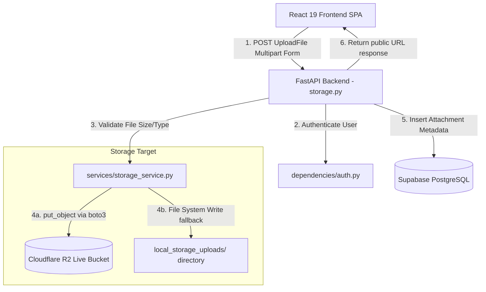

# Storage Architecture — Nexus PM

This document explains the storage architecture, access patterns, and file validation rules. It details the discrepancy between the planned presigned URL upload flow and the actual backend-mediated implementation.

---

## 1. Upload Flow Discrepancy Analysis

### Planned Flow (High-Level Design)
In standard cloud designs, clients request a short-lived S3/R2 presigned upload URL from the API, then upload the file binary directly to the object storage bucket. This saves API bandwidth and memory.

### Actual Production Implementation (Authoritative)
The current implementation uses a **Backend-Mediated Upload Flow**. The browser uploads files directly to the FastAPI server, which processes the file in memory, validates the file constraints, and pushes the binary to Cloudflare R2 (or a local disk emulator) via the `boto3` client.



---

## 2. File Validation and Security Checks

Before transmitting any file payload to Cloudflare R2, the backend executes verification rules in [storage_service.py](file:///c:/NEXUS%20PM%201/services/storage_service.py):

1. **Size Limits:** Enforces a maximum file size of **10 MB** (`MAX_FILE_SIZE = 10 * 1024 * 1024` bytes).
2. **File Extensions Verification:** Rejects files whose extensions do not match the permitted set (images, documents, archives, source code files).
3. **MIME-Type Check:** Explicitly parses content types against an allowed list of MIME-types to block execution payload uploads.
4. **Unique Key Generation:** Generates a unique UUIDv4 key for every uploaded file (e.g., `5a3b98c7...png`) to prevent namespace collisions or unauthorized overrides of existing files.

---

## 3. Storage RBAC & Isolation

* **Upload Access:** Only users authenticated with a valid JWT access token can access `/api/storage/upload`.
* **Metadata Association:** Attachment records committed to the `task_attachments` table link directly to both the creator (`user_id`) and task (`task_id`).
* **Deletion Lockdown:** A user can only delete files that they uploaded. The database query isolates deletion operations by checking the creator ID:
  ```python
  delete(TaskAttachment).where(
      TaskAttachment.file_key == file_key,
      TaskAttachment.user_id == current_user.id
  )
  ```
  This restricts delete privileges on the storage bucket, blocking unauthorized deletion of files by malicious actors.
