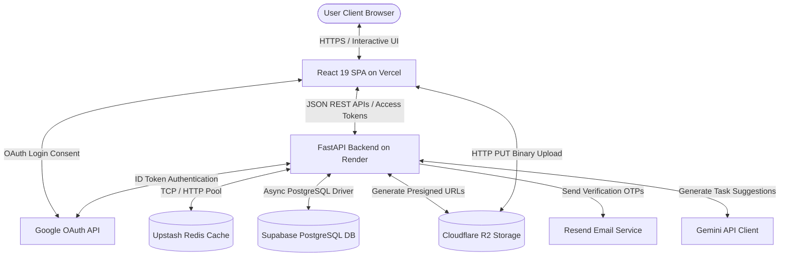

# System Architecture — Nexus PM

This document maps out the system components, data flow paths, and integration boundaries.

---

## 1. System Interaction Diagram

---

## 2. Component Directory

### Client Frontend (SPA)
* **Hosting:** Vercel CDN.
* **Technology:** React 19, TypeScript, Vite, Tailwind CSS.
* **Responsibilities:** Renders the user interfaces, routes pages, stores JWT Access Tokens in state memory, coordinates drag-and-drop Kanban state shifts, and performs direct-to-R2 uploads using presigned URLs.

### API Server Backend
* **Hosting:** Render Web Service.
* **Technology:** FastAPI, Python 3.12, Uvicorn/Gunicorn.
* **Responsibilities:** Exposes validation endpoints, secures routes using JWT verification, manages user and membership roles, generates upload permission parameters (presigned URLs), queries PostgreSQL, caches signup credentials, and proxies requests to Gemini.

### PostgreSQL Database
* **Hosting:** Supabase.
* **Technology:** PostgreSQL 15, SQLAlchemy, Alembic.
* **Responsibilities:** Stores users, projects, memberships, comments, notifications, activity logs, task cards, and attachments metadata.

### Redis Cache
* **Hosting:** Upstash.
* **Technology:** Serverless Redis.
* **Responsibilities:** Caches user registration data during verification window and stores dynamic OTP codes.

### Cloudflare R2
* **Hosting:** Cloudflare Global Edge.
* **Technology:** S3-compatible Object Storage.
* **Responsibilities:** Secure, high-speed storage for task files and user avatars with zero egress fees.

### Gemini AI API
* **Hosting:** Google AI.
* **Technology:** `google-genai` SDK (`gemini-2.5-flash`).
* **Responsibilities:** Suggests task lists based on description inputs.

### Resend Email Gateway
* **Hosting:** Resend API.
* **Technology:** SMTP / HTTP client.
* **Responsibilities:** Dispatches security, password reset, and registration OTP emails.
